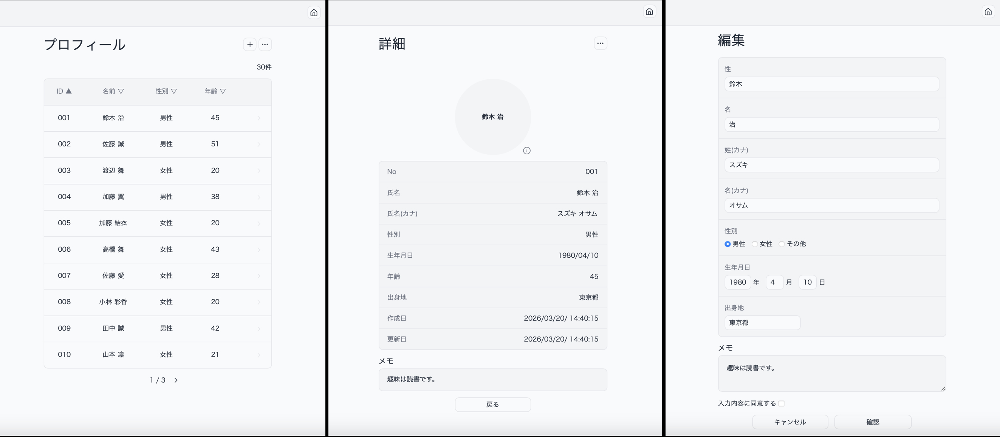
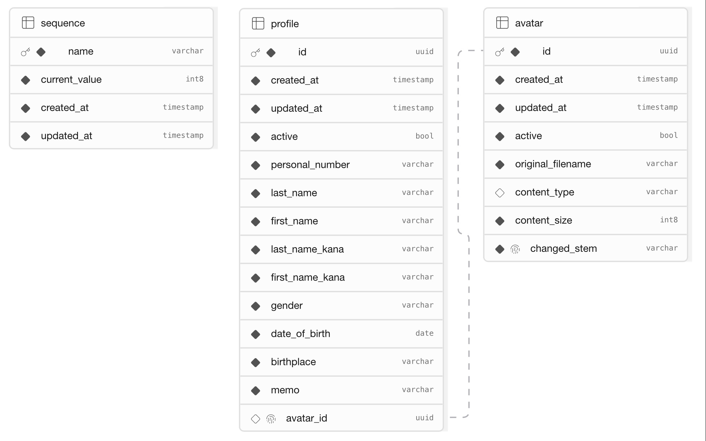

## 人物プロフィール管理Webアプリケーション
Spring Boot 3.5 と Java 21 を活用し、保守性とテストの容易性を追求したプロフィール管理システムです。
単なるCRUDの実装にとどまらず、オニオンアーキテクチャ（クリーンアーキテクチャ）の概念を取り入れ、ビジネスロジックの純粋性と疎結合な設計を意識して開発しました。

### 本番環境URL
🔗[tetsuro-aita.com](https://tetsuro-aita.com)
<br>※外部ストレージは無料枠を使用しているため繋がりにくい場合があります。何度かリロードしてください。

### デプロイ先
- アプリケーション:Render
- DB、ストレージ:supabase

## アプリケーション概要

### 目的
- Springフレームワーク（DI, Bean Validation, JPA等）の深い理解
- 責務分離を意識したアーキテクチャ設計の実践
- 外部API（Supabase Storage）との連携および例外設計の習得
- JUnit 5 を用いたテストコードによる品質担保の経験
- システム全体を構築し本番環境へデプロイ

### 画面別機能
- __一覧ページ(ホーム画面)__
    - プロフィール一覧を表示
    - 項目別に並べ替え
    - 昇順・降順でソート
    - ページネーションで１ページあたりの件数(固定値)を制限
    - 各データから詳細画面へ遷移
    - メニューボタンより削除済み一覧に切り替え
    - 新規作成ボタンより新規作成画面に遷移
- __詳細ページ__
    - 個人データを表示
    - アバターが登録されていれば表示
    - アバターの変更(バリデーションで制限)・削除<br>(削除済みのプロフィールはアバター操作不可)
    - メニューボタンより編集・論理削除<br>(削除済みのプロフィールは編集不可、物理削除、削除取消)
- __新規作成・編集のページ__
    - 氏名、性別、生年月日、出身地、メモ(任意)を登録
    - バリデーションによる入力値の制限
    - 登録・更新の前に確認画面を表示(RPGパターンを採用)



### 技術スタック

- __バックエンド__
    - 言語: Java 21
    - フレームワーク: Spring Boot 3.5系
    - アーキテクチャ: MVC (Model-View-Controller)
    - データアクセス: Spring Data JPA (Hibernate)
    - セキュリティ: Spring Security (監視モニター実装に伴うアクセス制御用)
    - ビルドツール: Maven
    - 監視モニター: Spring Boot Actuator, Spring Boot Admin
    - テスト: JUnit 5, MockWebServer (外部API連携等のシミュレーション)
    - バリデーション: Bean Validation (Hibernate Validator)

- __フロントエンド__
    - Thymeleaf(サーバサイドレンダリング)
    - HTML / CSS / JavaScript(トーストやアバター関連の実装で一部使用)

- __データベース__
    - PosgreSQL(本番/開発)
    - H2(テスト)

- __マイグレーション__
    - Flyway

- __外部API__
    - supabase Storage

- __環境構築__
    - vscode
    - Dev Container
    - Docker compose

### ディレクトリ構成とアーキテクチャ詳細

__Spring MVC__ をベースとした構成ですが、保守性とテストの容易性を向上させるため、 __オニオンアーキテクチャ(またはクリーンアーキテクチャ)__ の概念を取り入れた構成になっております。

ディレクトリ構成 ※主要なもののみ抜粋

```
.
├── .env.sample
├── app
│   ├── .devcontainer
│   │   └── devcontainer.json
│   ├── Dockerfile
│   ├── mvnw
│   ├── pom.xml
│   └── src
│       ├── main
│       │   ├── java
│       │   │   └── com
│       │   │       └── example
│       │   │           └── portfolio_simple_spring_mvc
│       │   │               ├── application
│       │   │               ├── domain
│       │   │               ├── infrastructure
│       │   │               └── presentation
│       │   └── resources
│       │       ├── application-dev.yml
│       │       ├── application.yml
│       │       ├── logback-spring.xml
│       │       ├── static
│       │       │   ├── css
│       │       │   └── js
│       │       └── templates
│       │           ├── fragments
│       │           └── profile
│       └── test
│           ├── java
│           │   └── com
│           │       └── example
│           │           └── portfolio_simple_spring_mvc
│           │               ├── application
│           │               ├── domain
│           │               ├── infrastructure
│           │               └── presentation
│           └── resources
│               ├── application-test.yml
│               └── db
├── docker-compose.yml
├── flyway
│   ├── .env.flyway
│   ├── conf
│   ├── flyway.sh
│   └── migration
├── health-monitor
│   ├── .devcontainer
│   │   └── devcontainer.json
│   ├── Dockerfile
│   ├── mvnw
│   ├── pom.xml
│   └── src
│       ├── main
│       │   ├── java
│       │   │   └── com
│       │   │       └── example
│       │   │           └── portfolio_health_monitor
│       │   └── resources
│       │       └── application.yml
│       └── test
│           └── java
│               └── com
│                   └── example
│                       └── portfolio_health_monitor
└── script
    ├── down.sh
    ├── setup.sh
    ├── start.sh
    └── stop.sh
```

- __/app__ :メインアプリケーション

    - __presentation__
        - フロント側とやり取りを行う層です。
        - リクエスト受け取り __application層__ に渡す、__application層__ からの結果を適切なレスポンスに変換し返すことに特化するように実装しました。
        - リクエストは __Command__ で受け取り、それを __Dispatcher__ に渡すことで __Dispatcher__ は適切な __CommandHandler__ を呼び出し実行するよう実装しました。 __Dispatcher__ は __HandledResult__ とういう統一された結果を返すため、必要であれば __Presenter__ で __ResponseEntity__ に変換し __REST API__ にも対応できるようにしました。インターフェースと一連の規則的な処理をすることで可読性と保守性を上げることを心掛けました。
    
    - __application__
        - この層は、 __Dispatcher__ に呼び出された __CommandHandler__ が __Domain層__ のロジックを __オーケストレーション(調整・実行)__ します。
        - __Domain層__ のロジックを原則インターフェースで呼び出しを行うため、__domainModuleConfig__ の各設定ファイルで __DI__ を行っております。
        - アバターの変更またはプロフィール削除における副作用は、今後新たにテーブルやカラムが追加された場合に備え __Listener__ に処理を委譲する仕様にしました。
        - アバター削除における副作用(ストレージからデータを削除)は、__Scheduler__ で定期的に実行するようにしました。
        - __トランザクション__ は基本的に __CommandHandlerのhandle()メソッド全体__ で行っておりますが、アバター生成においては例外発生時のデータの整合性を考慮し内部で別のトランザクションを設けました。

    - __domain__
        - この層はフレームワークや特定のライブラリに依存しないように __POJO__ でコーディングし、ビジネスロジックをカプセル化しました。
        <br>(__Entity__ おいては実装効率を優先し __JPAアノテーション__ を許容しています。)
        - __Port__ を設けることで __infrastructure層__ にロジックが漏れないようにすることと、技術スタックに変更が生じても保守性が保てるようにしました。
        - __StateResolver__ でオブジェクトの状態を判断し __State(状態)__ を生成します。
        - __Planner__ は __State__ を受け取り __Plan(計画)__ を生成します。
        - __Executor__ は __Plan__ を受け取り実行役に徹します。
        - パッケージ化することでテストの容易性と保守性を向上させました。

    - __infrastructure__
        - DB、外部ストレージとの連携に関してはドメイン層で定義したポートの各インターフェースを実装する形で実現しています。
        - DBは __jpaRepository__ を使いさらに抽象化することで共通的なCRUD処理の自動生成やSQL発行の隠蔽を行いました。
        - 外部ストレージ(supabase)との連携では、公式のSDKが提供されていないため、__RestClient__ でAPIを実装しました。

    - __例外設計__
        - 各層で専用のクラスを用意し、例外発生時は上層でキャッチせずに __ControllerAdvice__ でキャッチするように実装しました。
        - __ControllerAdvice__ では種類別に適切なレスポンスを返すと同時に、ログを実装することで原因究明をできるようにしました。

    - __データベース設計__
        
        - セキュリティ面を考慮し、DBにアクセスするユーザーは専用のユーザーを作成して最低限の権限のみを付与しました。
        - プロフィールに外部キーとしてアバターのIDを設定し参照するようにしています。アバターを設定しないプロフィールもあるため制約は __UNIQUE__ のみとしました。
        - オブジェクトの状態を判定するためにプロフィールとアバターのテーブルに __active__ を設定しました。
        - プロフィールは内部IDである __id(PRIMARY KEY)__ とは別に表示用IDとして __personal_number__ を設定しました。画面上、管理を容易にするのが目的です。
        - __SEQUENCE__ テーブルはプロフィール新規登録時に表示用IDを発行するために使用されます。発行するたびに __current_value__ がインクリメントされ更新されます。

    - __フロント設計__
        - 今回は主に __Spring__ の学習に重点を置いているためバックエンドサーバだけで完結できるようにSSR方式である __Thymeleaf__ テンプレートエンジンを使用しHTMLを直接返す仕様です。
        - アバター変更は画面全体を変える必要がないため、 __JavaScript__ でAPIの実装と画面の一部を変更する処理を実装しました。

- __/health-monitor__ :監視モニター
    - 今回は運用開始後のサーバ監視をどうするかという点で調べたところ __Spring Boot Admin__ なら手軽に実装することができるということで実装しました。正直、何ができるのかというところや詳しい設定方法などは学習していません。
    - 最低限の設定として監視サーバ、メインサーバ両方で __Spring Security__ を導入し特定のエンドポイントはアクセスできないように制御を行いました。
    - 今後のテーマとしては、異常が発生した場合の対処方法(通知設定やリカバリー方法)、サーバの稼働状態に対しての知識について深掘りしたいと思います。

- __/flyway__ :SQLファイルの管理
    - 開発・本番両方で __flyway__ によるSQLの管理を行いました。
    - 理由としてはAIの助言によるものでもありますが主に履歴管理と開発環境で実行したものが、本番環境でも正確に再現できることです。整合性に厳格で __migrate__ に失敗してもログを見ることで原因を特定できることが非常に助かりました。
    - 実行方法はコンテナ経由で __JDBC URL__ で指定したDBに __migrate__ を実行します。

- __/script__ :スクリプトファイルの配置
    - 公開用リポジトリ用(プログラム実行等のスクリプトを配置)
    - 実際の開発環境では __devcontainer__ を使用してるためコンテナの立ち上げなどはGUI操作になりがちで __dockerコマンド__ はほぼ使用していませんが、今回のスクリプト作成でdockerコマンド対する知識が少しだけ深まりました。

## 開発環境での実行

ローカルで動かす場合は、以下の方法をご利用ください。
<br>※どちらの方法でも、__Docker compose__ が必要です。

### 共通設定
- ローカルにリポジトリをクローンしてください。
- 本アプリケーションは外部ストレージとして __supabase__ [(supabase.com)](https://supabase.com)のストレージを使用しております。プログラムを実行する前に外部ストレージのセットアップ行い __.env.example__ を参考に指定の値を設定した __.env__ ファイルをルートディレクトリに作成してください。

### 方法A: Dev Container

※事前に __Dev Container__ の拡張機能を追加してください。

1. VS codeをお使いの方は __app__ と __health-monitor__ をそれぞれ別ウィンドウで開きコンテナに切り替えてください。

2. DBの初期化とマイグレーションの実行のために以下のコマンドをプロジェクトのルートディレクトリで実行してください。
<br>(コンテナ内からではありません)
```
bash ./flyway/flyway.sh
```

3. 各コンテナのコンソールで以下のコマンドを実行してください。
<br>__health-monitor__ のコンテナから実行してください。
```
./mvnw spring-boot:run
```

4. ブラウザで __.env__ で設定したポートのローカルホストにアクセスしてください。

### 方法B: docker compose

Windowsの方は Git Bash または WSL2 のターミナルから実行してください。

1. 以下のコマンドをプロジェクトのルートディレクトリで実行してください。
```
bash ./script/setup.sh
```

2. ブラウザで __.env__ で設定したポートのローカルホストにアクセスしてください。